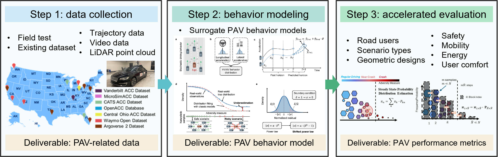
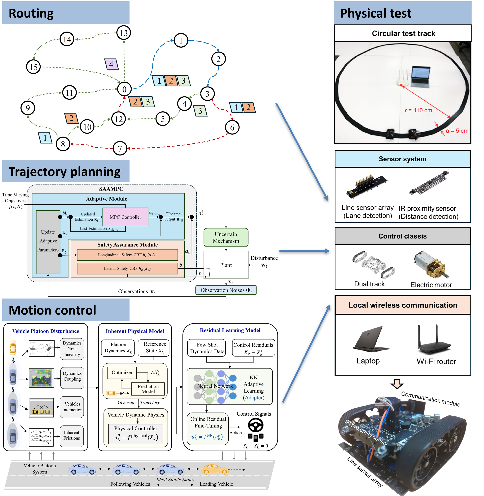
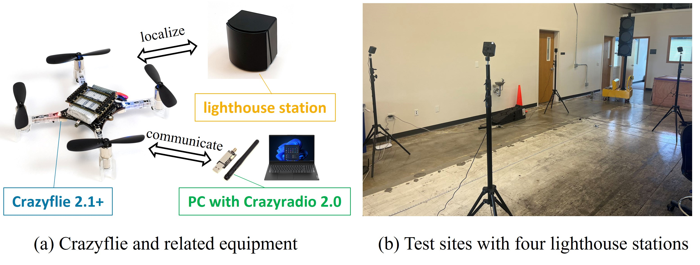

## About me

My name is Hang Zhou, and I am a third-year Ph.D. student at the University of Wisconsin–Madison in the [Connected & Autonomous Transportation Systems (CATS) Laboratory](https://catslab.engr.wisc.edu/), advised by [Prof. Xiaopeng “Shaw” Li](https://catslab.engr.wisc.edu/staff/xiaopengli/). I got a Master’s degree from UW–Madison at 2025 and a Bachelor’s degree from Huazhong University of Science and Technology at 2023, where I worked with [Prof. Hu Qin](https://cm.hust.edu.cn/info/1745/24587.htm) and [Prof. Chun Cheng](https://sites.google.com/site/chun123cheng/home).

My current research focuses on **Production Automated Vehicles (PAVs) evaluation**. My studies trying to solve two key challenges in the PAV evaluation: (1) PAV manufacturers do not disclose the internal control algorithms, and (2) the safety testing of PAVs requires large-scale field testing or simulation, which is prohibitively time- and cost-intensive. To address these challenges, my studies propose a data-driven pipeline for evaluating PAV performance. We first collected PAV-relate from field test and literature review, then build surrogate behavior model for the tested-PAV, and finally generate scenario library for specific evaluation metrics.

To promote research across different steps of this pipeline, we initiated an open-source ecosystem: **the [OpenPAV](https://github.com/OpenPAV/OpenPAV) platform**. Our goal is to provide high-quality data and benchmark algorithms for each stage, and eventually establish a billboard showcasing the performance ranking of various PAV brands to offer the public a scientific reference. 
<!-- Although still in its early stage, the project has already united three research groups, attracted over 200 GitHub stars, and related publications have received more than 30 citations. -->

Another focus of my research is the **routing, trajectory planning, and control of robotics**, especially for automated vehicles. For example, our work has developed a technical roadmap for **Modular Automated Vehicles** that leverages their advantages of en-route reformation while ensuring safety during docking and splitting operations, and tested the method in a reduced-scale test bed.

I'm also interested in broader applications of **AI and optimization in intelligent transportation systems**, such as **urban air mobility**. Our research integrates drones with transportation and logistics applications, combining theoretical analysis with physical tests to study the potential impacts of future drone systems on cities.

## News

I plan to attend the Transportation Research Board (TRB) Annual Meeting in Washington, D.C., in January 2026, and look forward to connecting with more colleagues and friends there!