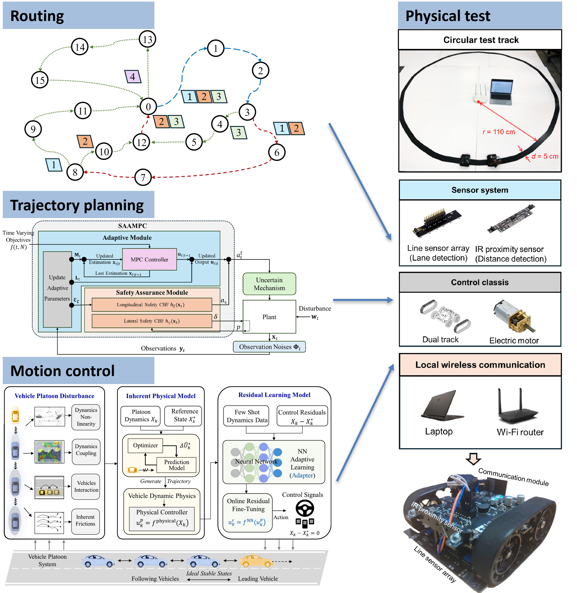

Benefiting from an educational background across multiple departments, I have developed broad research interests. In particular, I concentrate on **emerging technologies in transportation**, such as automated vehicles and drones. My work mainly applies methods from artificial intelligence (AI) and operations research (OR) to address the challenges posed by these technologies.

## Automated vehicle evaluation

My current research focuses on **Production Automated Vehicles (PAVs) evaluation**. My studies trying to solve two key challenges in the PAV evaluation: (1) PAV manufacturers do not disclose the internal control algorithms, and (2) the safety testing of PAVs requires large-scale field testing or simulation, which is prohibitively time- and cost-intensive. To address these challenges, my studies propose a data-driven pipeline for evaluating PAV performance. We first collected PAV-relate from field test and literature review, then build surrogate behavior model for the tested-PAV, and finally generate scenario library for specific evaluation metrics.

To promote research across different steps of this pipeline, we initiated an open-source ecosystem: **the [OpenPAV](https://github.com/OpenPAV/OpenPAV) platform**. Our goal is to provide high-quality data and benchmark algorithms for each stage, and eventually establish a billboard showcasing the performance ranking of various PAV brands to offer the public a scientific reference.

Related publications:
- **Zhou, H.**, Ma, C., Shen, S., Liang, Z., & Li, X. (2026). Towards full-scenario safety evaluation of automated vehicles: A volume-based method. *Transportation Research Part C: Emerging Technologies*, 183, 105485. [Link](https://doi.org/10.1016/j.trc.2025.105485) [Code](https://github.com/CATS-Lab/Volume_AV_Evaluation)
  
- **Zhou, H.**, Ma, C., Ma, K., & Li, X. (2025). Quantile-based scenario generation for automated vehicle safety evaluation. *Accident Analysis & Prevention*, 218, 108043. [Link](https://www.sciencedirect.com/science/article/pii/S0001457525001290)
  
- **Zhou, H.**, Ma, K., Liang, S., Li, X., & Qu, X. (2024). A unified longitudinal trajectory dataset for automated vehicles. *Scientific Data*, 11, 1123. [Link](https://doi.org/10.1038/s41597-024-03795-y) [Code](https://github.com/CATS-Lab/Filed-Experiment-Data-ULTra-AV)

## Robotics vehicle control and trajectory planning

Another focus of my research is the **routing, trajectory planning, and montion control of robotics**, especially for automated vehicles. For example, our work has developed a technical roadmap for **[modular automated vehicles](https://www.next-future-mobility.com/)** that leverages their advantages of en-route reformation while ensuring safety during docking and splitting operations, and tested the method in a reduced-scale test bed.

Related publications:
- **Zhou, H.**, Ma, C., Cai, X., Ma, K., Li, X., & Ran, B. (2025). Security strategy against generalized inter-vehicle cyberattacks in car-following scenarios for connected and autonomous vehicles. *Transportation Research Part C: Emerging Technologies*, 178, 105216. [Link](https://doi.org/10.1016/j.trc.2025.105216) [Code](https://github.com/CATS-Lab/Cybersecurity)

- **Zhou, H.**, Zhang, P., Liang, Z., Li, H., & Li, X. (2025). Coverage trajectory planning problem on 3D terrains with safety constraint for automated lawn mower: Exact and heuristic approaches. *Robotics and Autonomous Systems*, 105109. [Link](https://doi.org/10.1016/j.robot.2025.105109) [Code](https://github.com/CATS-Lab/Mower-CTPP-3D)

- Zhang, P., Huang, H., **Zhou, H.**, Shi, H., Long, K., & Li, X. (2025). Online adaptive platoon control for connected and automated vehicles via physical enhanced residual learning. *Transportation Research Part C: Emerging Technologies*, 178, 105242. [Link](https://doi.org/10.1016/j.trc.2025.105242) [Code](https://github.com/CATS-Lab/AV-Control-PERL_Platooning)

## Urban air mobility

I'm also interested in broader applications of **AI and optimization in intelligent transportation systems**, such as **urban air mobility**. Our research integrates drones with transportation and logistics applications, combining theoretical analysis with physical tests to study the potential impacts of future drone systems on cities.

Related publications:
- **Zhou, H.**, Zhai, Y., Shen, S., Ouyang, Y., Shi, X., & Li, X. Developing a fundamental diagram for urban air mobility based on physical experiments. [Link](https://arxiv.org/abs/2512.21425) [Code](https://github.com/CATS-Lab/UAM-FD)

- **Zhou, H.**, Qin, H., Cheng, C., & Rousseau, L. M. (2023). An exact algorithm for the two-echelon vehicle routing problem with drones. *Transportation Research Part B: Methodological*, 168, 124–150. [Link](https://doi.org/10.1016/j.trb.2023.01.002)

## Smart logistics

Before my Ph.D., my former research with [Prof. Hu Qin](https://cm.hust.edu.cn/info/1745/24587.htm) and [Prof. Chun Cheng](https://sites.google.com/site/chun123cheng/home) focused on optimization problems in logistics using OR algorithms. We developed tailored solution methods for many emerging transportation modes, including various heuristic and exact algorithms. This solid foundation in OR has equipped me with strong analytical and modeling skills for addressing new research problems during my Ph.D. studies.

Related publications:
- **Zhou, H.**, Li, Y., Ma, C., Long, K., & Li, X. (2025). Modular vehicle routing problem: Applications in logistics. *Transportation Research Part E: Logistics and Transportation Review*, 197, 104022. [Link](https://doi.org/10.1016/j.tre.2025.104022) [Code](https://github.com/CATS-Lab/MVRP)

- **Zhou, H.**, Qin, H., Cheng, C., & Rousseau, L. M. (2023). An exact algorithm for the two-echelon vehicle routing problem with drones. *Transportation Research Part B: Methodological*, 168, 124–150. [Link](https://doi.org/10.1016/j.trb.2023.01.002)

- **Zhou, H.**, Qin, H., Zhang, Z., & Li, J. (2022). Two-echelon vehicle routing problem with time windows and simultaneous pickup and delivery. *Soft Computing*, 26(7), 3345–3360. [Link](https://doi.org/10.1007/s00500-021-06712-2) [Code](https://github.com/zll-hust/2E-VRPTWSPD)